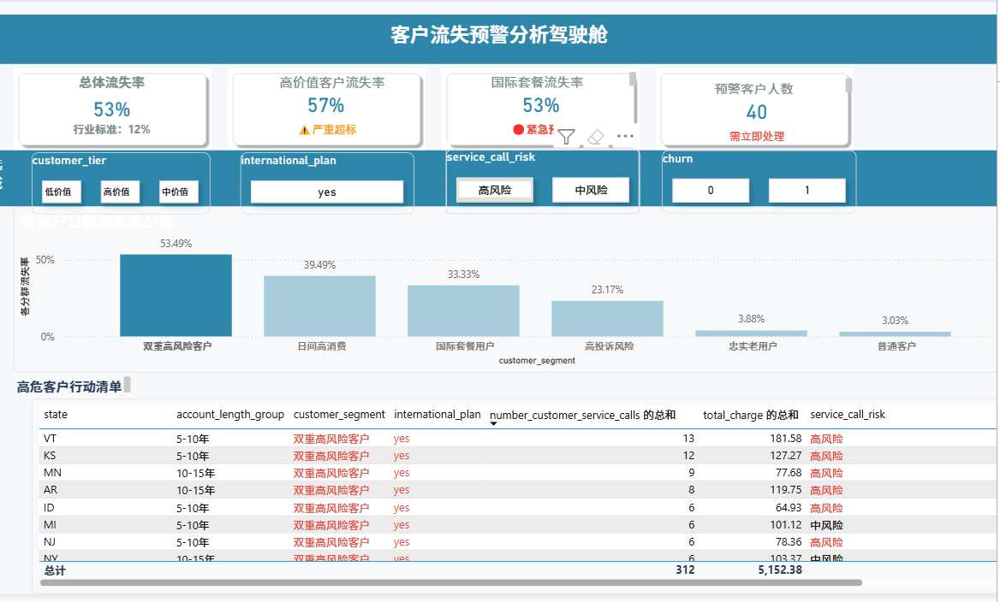

# 🚨 客户流失诊断与主动预警系统

## 📋 这个项目是做什么的？

我们建立了一套智能预警系统，能够：
- **提前发现**可能流失的客户
- **自动筛选**需要跟进的客户名单
- **指导业务团队**优先处理最紧急的情况

**最大的价值**：变"事后补救"为"提前预防"，让团队有足够时间留住客户。

---

## 💡 我们的核心发现
通过数据分析，我们发现三类最容易流失的客户：

### ⃣ **最紧急的客户**
> **特征**：购买了国际套餐 + 最近频繁联系客服（超过3次）
> - **流失可能性**：超过一半（53%）
> - **涉及客户数**：40人
> - **建议**：需要立即联系

### ⃣ **高风险的客户**
> **特征**：每月日间话费超过40元 + 没有国际套餐
> - **流失可能性**：接近四成（39%）
> - **涉及客户数**：308人
> - **建议**：本周内联系
### ⃣ **需要关注的客户**
> **特征**：有国际套餐但客服联系较少
> - **流失可能性**：三分之一（33%）
> - **涉及客户数**：162人
> - **建议**：两周内回访
## 🎯 我们做了什么？

### 第一步：找到问题根源
- 分析了大量客户数据
- 对比了流失客户和留存客户的特征
- 确定了上面三个关键预警信号

**📊 详细分析资料：**

| 格式 | 用途 | 适合谁 | 查看方式 |
|------|------|--------|----------|
| **📄 HTML交互报告** | 完整可视化分析结果 | 所有同事 | [在线查看](https://Yassi7379.github.io/customer_churn_prediction/customer_churn_prediction.html) |
| **💻 Jupyter源代码** | 完整分析过程代码 | 技术同事 | [查看源码](./customer_churn_prediction.ipynb) |

### 第二步：建立预警系统
我们将分析结果变成了一个**简单易用的监控看板**：

*双重高风险客户名单截图*
**看板功能包括：**
- 📊 **整体风险概览**：查看各类风险客户分布
- 👥 **重点客户名单**：筛选不同风险等级的客户

**📋 想查看看板完整效果？**
[查看监控看板完整预览](./customer_churn_prediction_dashboard.pdf)

